# MLM Crypto Ecosystem – Hybrid Token + NFT Model

## 🌟 Overview

A revolutionary Hybrid Crypto + MLM Ecosystem combining multiple income streams with blockchain technology.

### 🔧 Core Components
- **Monoline Income** - Global single line system
- **Unilevel Income** - 21-level deep compensation
- **Direct Bonus** - 8% immediate rewards
- **Rank Rewards** - Performance-based achievements
- **NFT-Based ROI System** - Lifetime returns
- **Loan & Restaking Program** - Financial flexibility

## 🪙 Token Utilities

**Fixed Supply:** 1.2 Million Tokens

**Key Features:**
- 9% Burning Protocol on transactions
- Staking rewards system
- Internal Desk Exchange
- Holding benefits with ROI

## 🚀 Ecosystem Flow

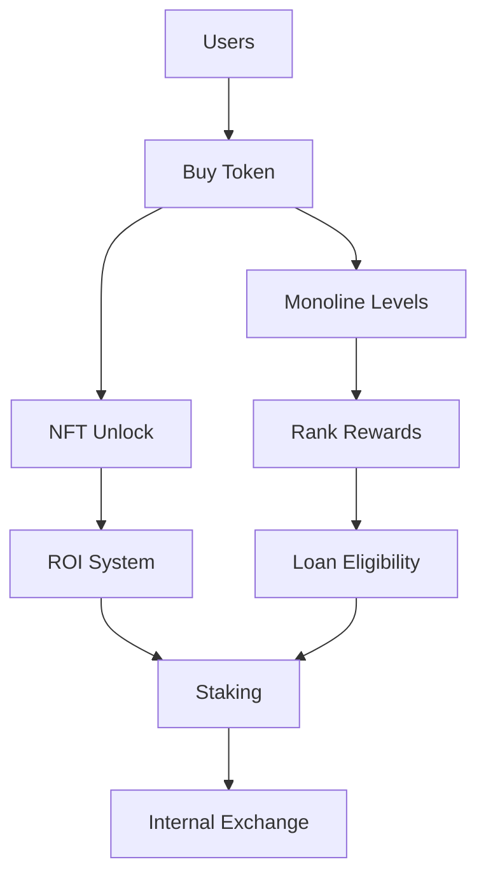

## 📋 Entry & Activation

### Requirements
- **Free Entry** via Desk Approach
- **$30 One-Time Activation** fee

### Income Structure
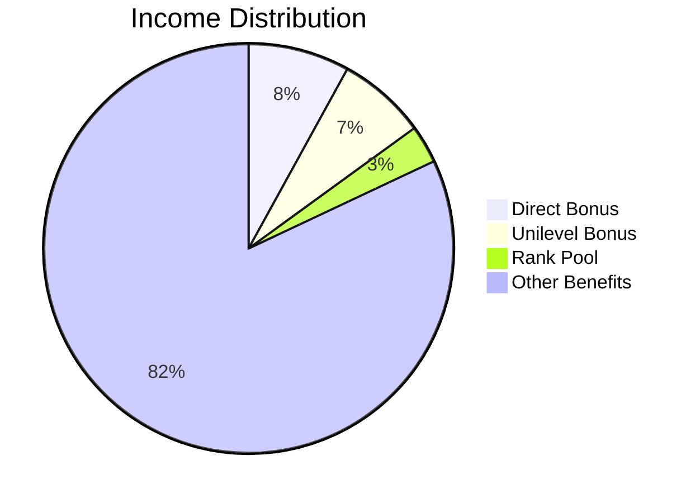

## 👥 Referral System

### Referral Logic
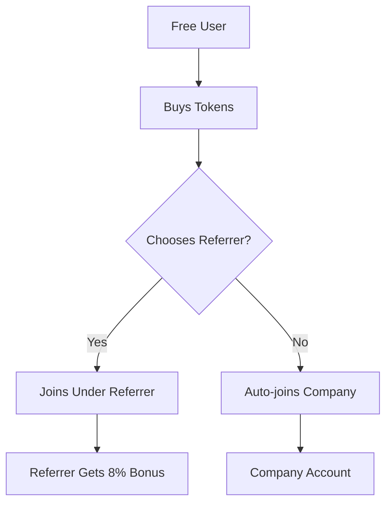

**Example:**
```
User A (free) → Buys tokens → Chooses User B as referrer
User B receives 8% direct bonus on User A's activation
```

## 💰 Direct Bonus (8%)

### Calculation Formula
```
Direct Bonus = Joining Amount × 8%
```

### Practical Example
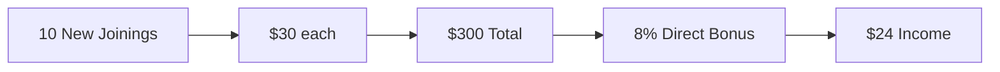

**Flow:** 
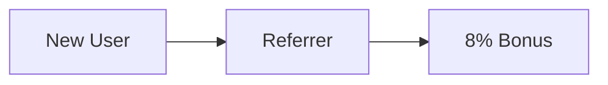

## 🏗️ Unilevel Income (21 Levels)

### Commission Structure
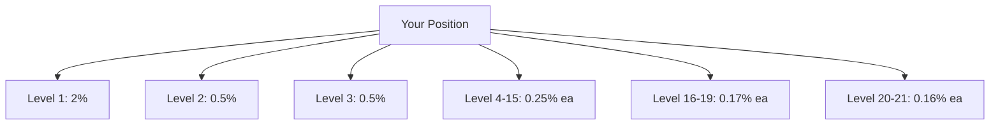

### Real-World Example
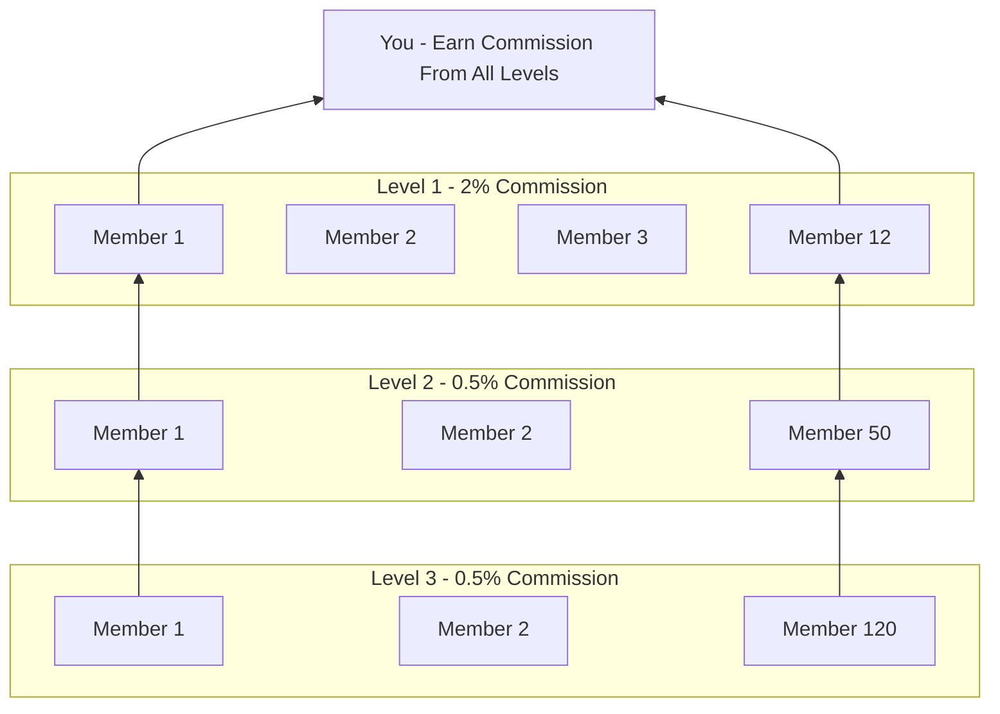

### Organizational Structure
```
You (Root)
 ├── Level 1 (2% commission) - 12 members
 │     ├── Member A
 │     ├── Member B
 │     └── 10 more members...
 ├── Level 2 (0.5% commission) - 50 members
 │     ├── Network A
 │     └── Network B
 └── Level 3 (0.5% commission) - 120 members
       ├── Extended Network
       └── Deep Network
```

## 🌐 Monoline System

### Global Single Line Concept
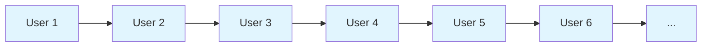

### Key Controls
- NFT unlock levels
- Rank performance tracking
- Loan eligibility determination

### Monoline Progression
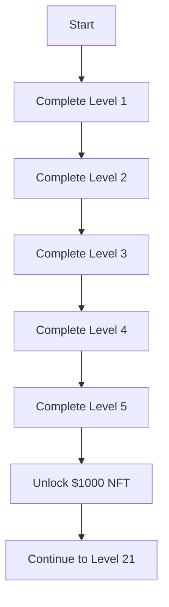

## 🏆 Rank Reward Program

### Performance-Based Ranks
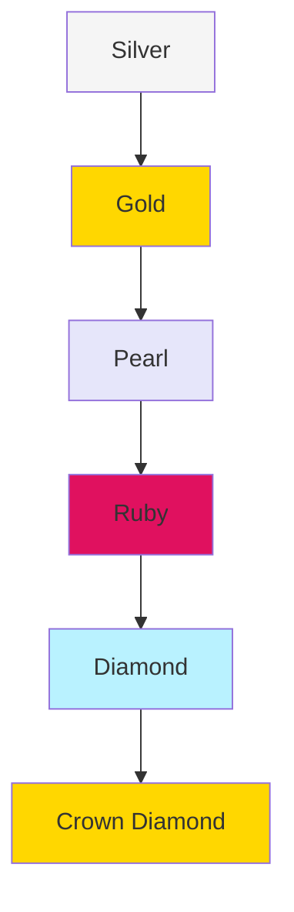

### Rank Benefits Comparison
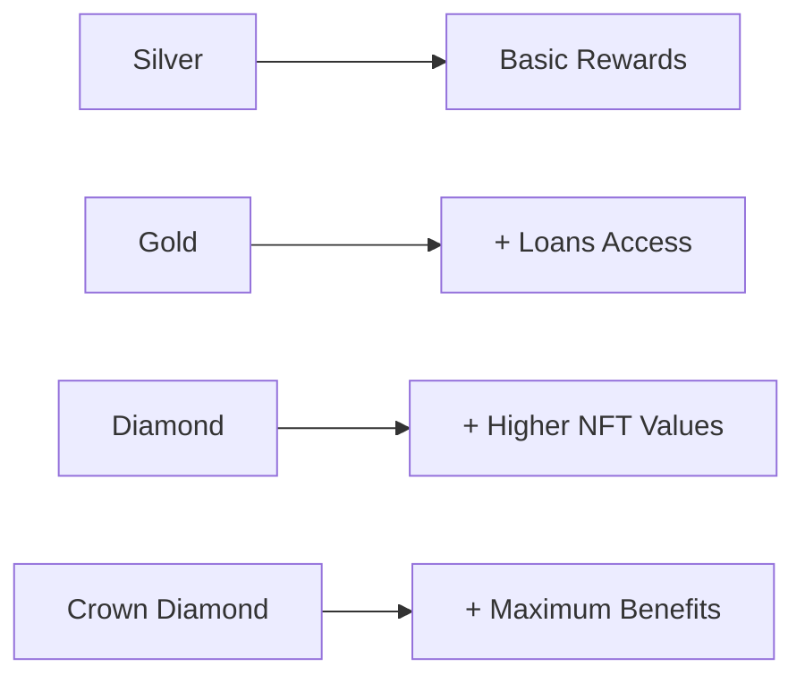

## 🎯 NFT-Based ROI System

### Eligibility Requirements
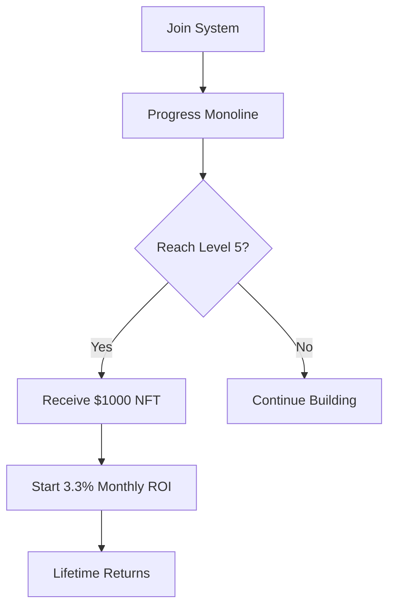

### ROI Timeline
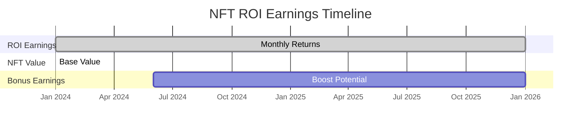

### Example Calculation
```
$1,000 NFT × 3.3% = $33 monthly ROI
Annual ROI: $33 × 12 = $396 (39.6% annual return)
```

## ⚡ ROI Boost System

### Boost Mechanism
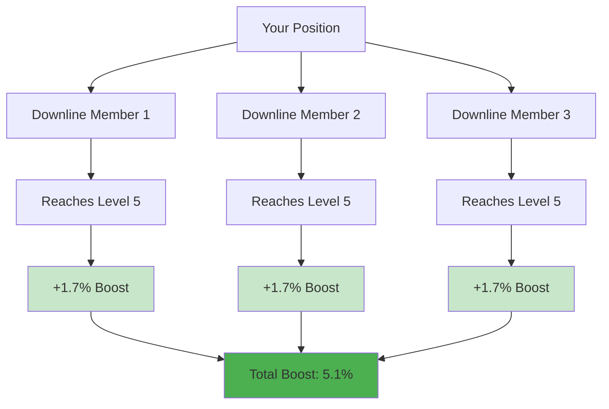

### Boost Example
```
3 achievers in your downline = 3 × 1.7% = +5.1% Boost
New Total ROI: 3.3% + 5.1% = 8.4% Monthly
```

## 📊 NFT Upgrade Levels

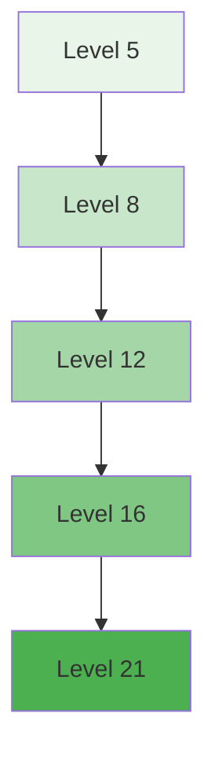

### NFT Value Progression
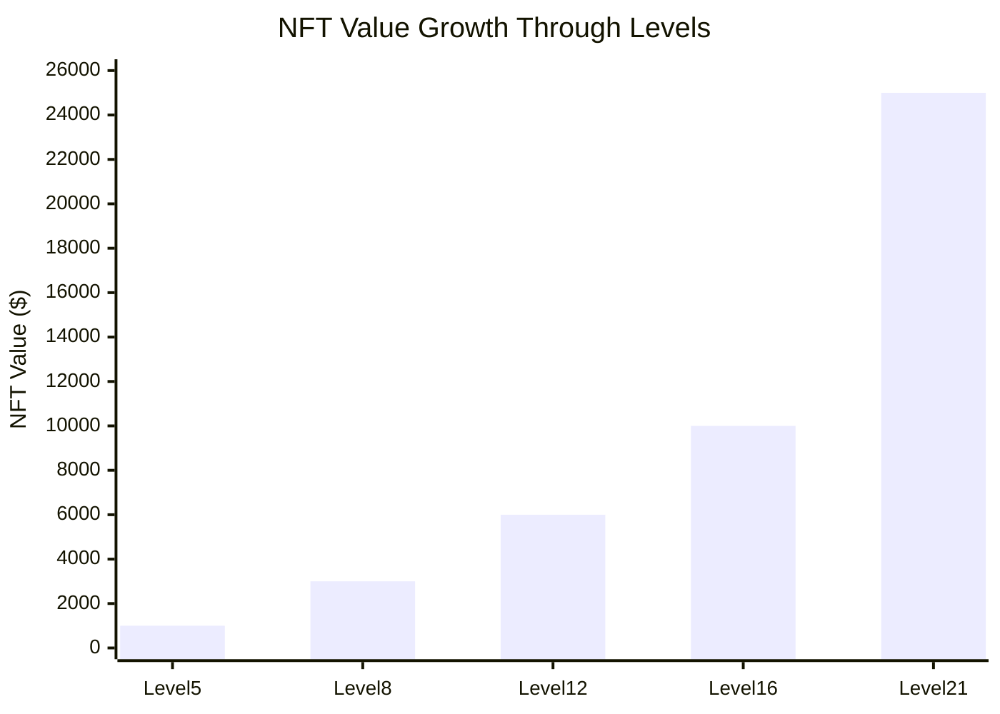

## 🔄 NFT Maintenance Rules

### Active Status Requirements
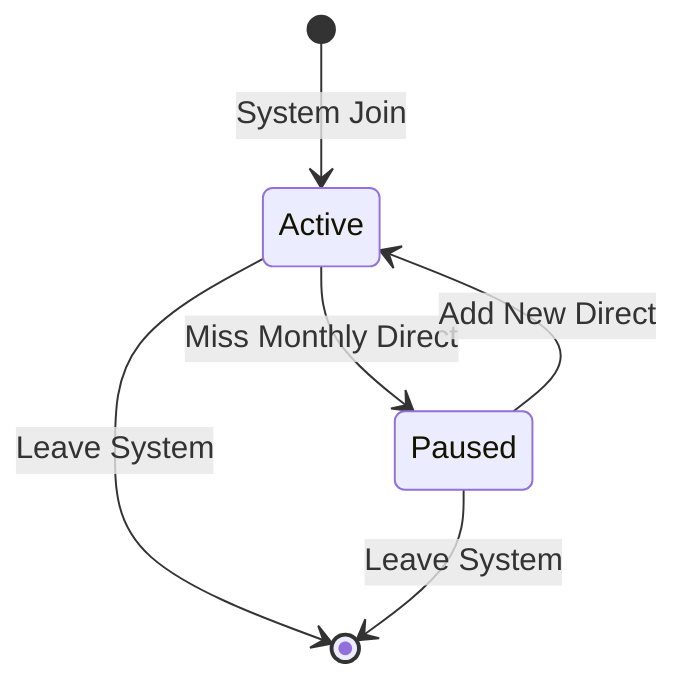

**Example Maintenance:**
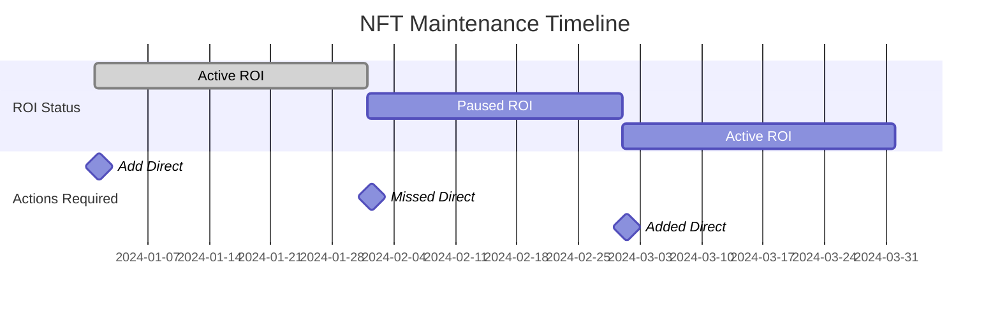

## 💳 Loan System

### Eligibility & Tiers
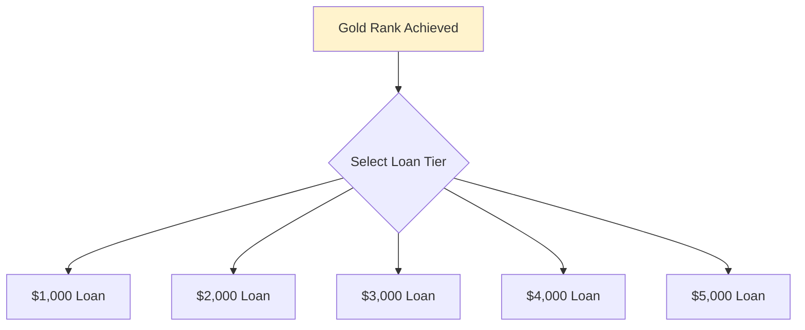

## 📉 Loan Recovery Rules

### Deduction Schedule
```mermaid
xychart-beta
    title "Monthly Loan Deduction Percentage"
    x-axis [1000$, 2000$, 3000$, 4000$, 5000$]
    y-axis "Deduction %" 0 --> 60
    line [10, 20, 30, 40, 50]
```

### Unlock Progression
```mermaid
graph LR
    A[Loan Taken] --> B[Monthly Deductions]
    B --> C[50% Repaid]
    C --> D[5% Tokens Unlock]
    B --> E[70% Repaid]
    E --> F[10% Tokens Unlock]
    B --> G[100% Repaid]
    G --> H[Full Unlock + Staking]
    
    style C fill:#fff3cd
    style E fill:#ffe0b2
    style G fill:#c8e6c9
```

### Complete Loan Flow
```mermaid
flowchart TD
    A[Take Loan] --> B[Monthly Deductions Start]
    B --> C{Check Repayment %}
    C -->|50%| D[Unlock 5% Tokens]
    C -->|70%| E[Unlock 10% Tokens]
    C -->|100%| F[Full Unlock]
    D --> C
    E --> C
    F --> G[Activate Staking]
    G --> H[Restaking Program]
```

## 🔄 Restaking Program

### Post-Loan Benefits
```mermaid
timeline
    title Restaking Program Timeline
    section Loan Phase
    Month 1-10 : Loan Active<br>Monthly Deductions
    Month 10 : Loan Fully Repaid
    section Restaking Phase
    Month 11-22 : 3% Monthly ROI<br>12-month Lock
    Month 23+ : Funds Available
```

### Restaking Example
```
$1,000 fully repaid → 3% monthly ROI = $30 monthly
12-month lock ensures consistent returns
```

## 💎 Tokenomics

### Supply Distribution
```mermaid
pie title Token Distribution
    "Locked Supply" : 80
    "Circulating Supply" : 20
```

### Burning Mechanism (9%)
```mermaid
graph TD
    A[Total Transactions] --> B[9% Burning Applied]
    B --> C[ROI Payouts]
    B --> D[Token Transfers]
    B --> E[Internal Exchange]
    B --> F[Fee Collections]
    
    C --> G[Reduced Supply]
    D --> G
    E --> G
    F --> G
    G --> H[Price Appreciation]
```

## 📈 Token Price Mechanism

### Price Drivers Diagram
```mermaid
graph TD
    A[Burning Mechanism] --> B[Supply Decreases]
    C[Staking Program] --> D[Circulation Decreases]
    E[NFT Locking] --> F[Demand Increases]
    
    B --> G[Token Price ↑]
    D --> G
    F --> G
```

### Price Calculation Example
```mermaid
graph LR
    A[Market Cap: $1,200,000] --> C[Token Price]
    B[Circulating Supply: 240,000] --> C
    C --> D[$5.00 per token]
```

## 🌱 Sustainability Model

### System Stability Factors
```mermaid
mindmap
  root((Sustainability))
    )Economic Mechanisms(
      )Burning Protocol(
        Supply Reduction
        Price Support
      )Token-based ROI(
        No Cash Drain
        System Circulation
      )Staking Locks(
        Reduced Selling
        Price Stability
      )
    )Structural Controls(
      )Loan Auto-deduction(
        Guaranteed Recovery
        Risk Management
      )NFT Unlock Requirements(
        Performance-based
        Organic Growth
      )Deep Unilevel(
        Long-term Growth
        Sustainable Commissions
      )Monoline System(
        Verification
        Performance Tracking
      )
```

## 🏦 Internal Exchange & Support

### Platform Architecture
```mermaid
graph TB
    A[User Dashboard] --> B[Internal Exchange]
    A --> C[Multi-language Support]
    
    B --> D[Buy Tokens]
    B --> E[Sell Tokens]
    B --> F[Token Swap]
    
    C --> G[English]
    C --> H[Urdu]
    C --> I[Hindi]
    C --> J[Arabic]
    C --> K[Indonesian]
    
    style A fill:#e3f2fd
    style B fill:#f3e5f5
```

## 🎯 Getting Started Process

### Complete User Journey
```mermaid
flowchart TD
    A[Free Registration] --> B[$30 Activation]
    B --> C[Build Network]
    C --> D[Progress Monoline]
    D --> E[Unlock NFT]
    E --> F[Earn ROI]
    F --> G[Upgrade NFT]
    G --> H[Reach Gold Rank]
    H --> I[Access Loans]
    I --> J[Repay Loan]
    J --> K[Restake & Earn]
    
    style A fill:#e8f5e8
    style E fill:#c8e6c9
    style I fill:#fff3cd
    style K fill:#4caf50
```

---
