# MLM Crypto Ecosystem – Hybrid Token + NFT Model

## 🌟 Overview
A revolutionary Hybrid Crypto + MLM Ecosystem combining multiple income streams with blockchain technology.

## 🔧 Core Components
- **Monoline Income** - Global single line system
- **Unilevel Income** - 21-level deep compensation
- **Direct Bonus** - 8% immediate rewards
- **Rank Rewards** - Performance-based achievements
- **NFT-Based ROI System** - Lifetime returns
- **Loan & Restaking Program** - Financial flexibility

## 🪙 Token Utilities
**Fixed Supply:** 1.2 Million Tokens

**Key Features:**
- 9% Burning Protocol on transactions
- Staking rewards system
- Internal Desk Exchange
- Holding benefits with ROI

## 🚀 Ecosystem Flow

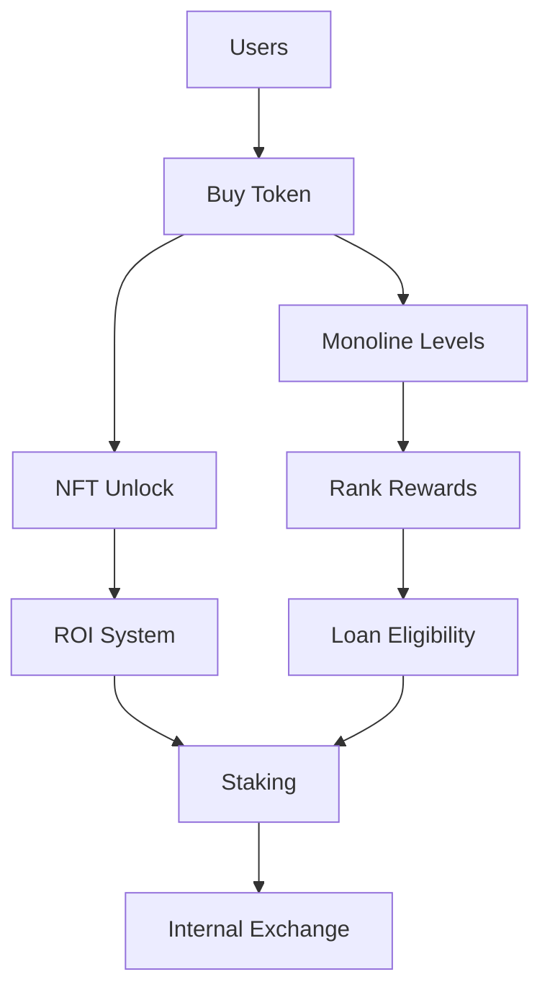

## 📋 Entry & Activation

### Requirements
- Free Entry via Desk Approach
- $30 One-Time Activation fee

### Income Structure

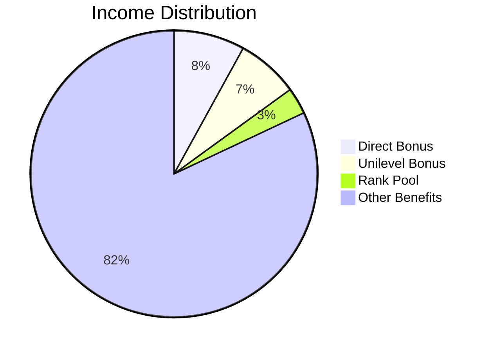

## 👥 Referral System

### Referral Logic

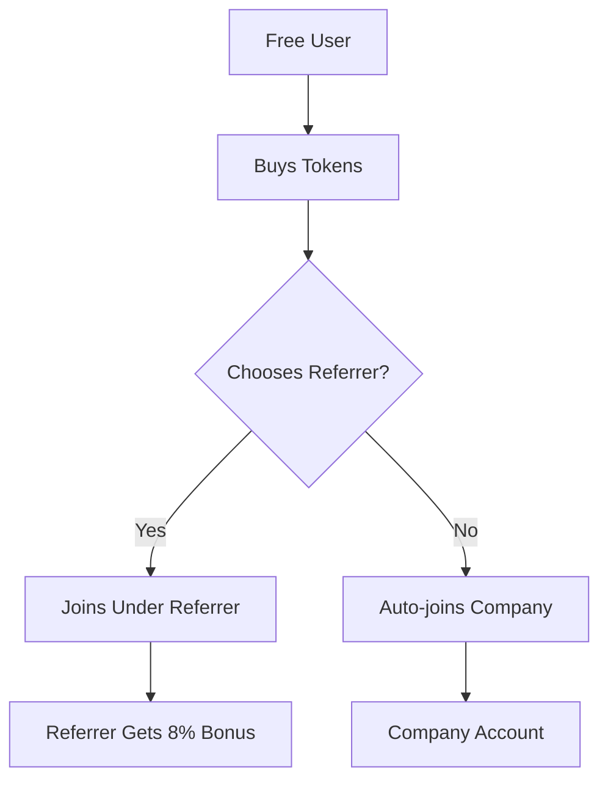

**Example:**
- User A (free) → Buys tokens → Chooses User B as referrer
- User B receives 8% direct bonus on User A's activation

## 💰 Direct Bonus (8%)

### Calculation Formula
**Direct Bonus = Joining Amount × 8%**

### Practical Example

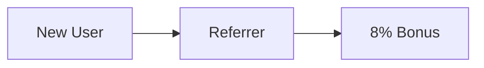

## 🏗️ Unilevel Income (21 Levels)

### Commission Structure

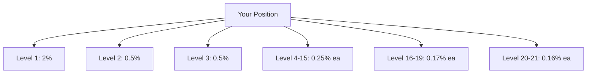

### Real-World Example

**Organizational Structure**
```
You (Root)
 ├── Level 1 (2% commission) - 12 members
 │     ├── Member A
 │     ├── Member B
 │     └── 10 more members...
 ├── Level 2 (0.5% commission) - 50 members
 │     ├── Network A
 │     └── Network B
 └── Level 3 (0.5% commission) - 120 members
       ├── Extended Network
       └── Deep Network
```

## 🌐 Monoline System

### Global Single Line Concept

**Key Controls**
- NFT unlock levels
- Rank performance tracking
- Loan eligibility determination

### Monoline Progression

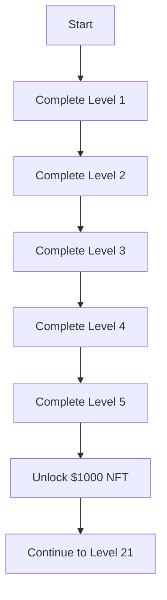

## 🏆 Rank Reward Program

### Performance-Based Ranks

| Rank | Requirements | Benefits |
|------|--------------|----------|
| Bronze | Complete Level 5 | Basic NFT Access |
| Silver | Complete Level 8 | Enhanced ROI |
| Gold | Complete Level 12 | Loan Access |
| Platinum | Complete Level 16 | Higher Commissions |
| Diamond | Complete Level 21 | Maximum Benefits |

## 🎯 NFT-Based ROI System

### Eligibility Requirements
- Complete Monoline Level 5
- $30 Activation Fee Paid
- Active Account Status

### ROI Timeline
- **Monthly ROI:** 3.3% of NFT value
- **Payment:** Continuous lifetime returns
- **Compounding:** Available through restaking

### Example Calculation
- $1,000 NFT × 3.3% = $33 monthly ROI
- Annual ROI: $33 × 12 = $396 (39.6% annual return)

## ⚡ ROI Boost System

### Boost Mechanism

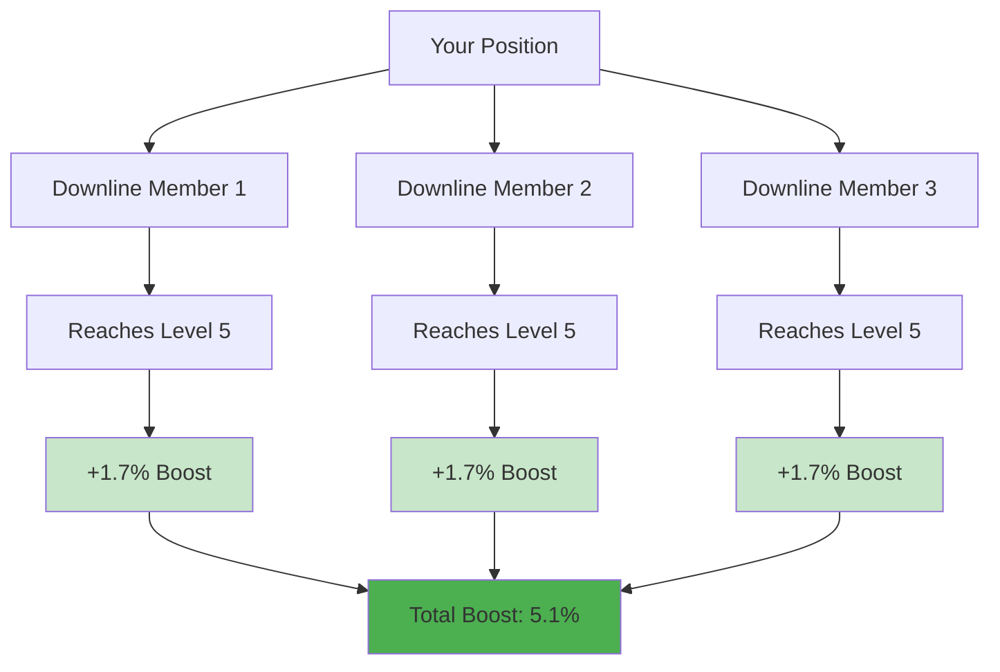

### Boost Example
- 3 achievers in your downline = 3 × 1.7% = +5.1% Boost
- New Total ROI: 3.3% + 5.1% = 8.4% Monthly

## 📊 NFT Upgrade Levels

### NFT Value Progression

| Level | NFT Value | Requirements |
|-------|-----------|--------------|
| Level 5 | $1,000 | Complete first 5 levels |
| Level 8 | $3,000 | Complete 8 levels |
| Level 12 | $6,000 | Complete 12 levels |
| Level 16 | $10,000 | Complete 16 levels |
| Level 21 | $25,000 | Complete all 21 levels |

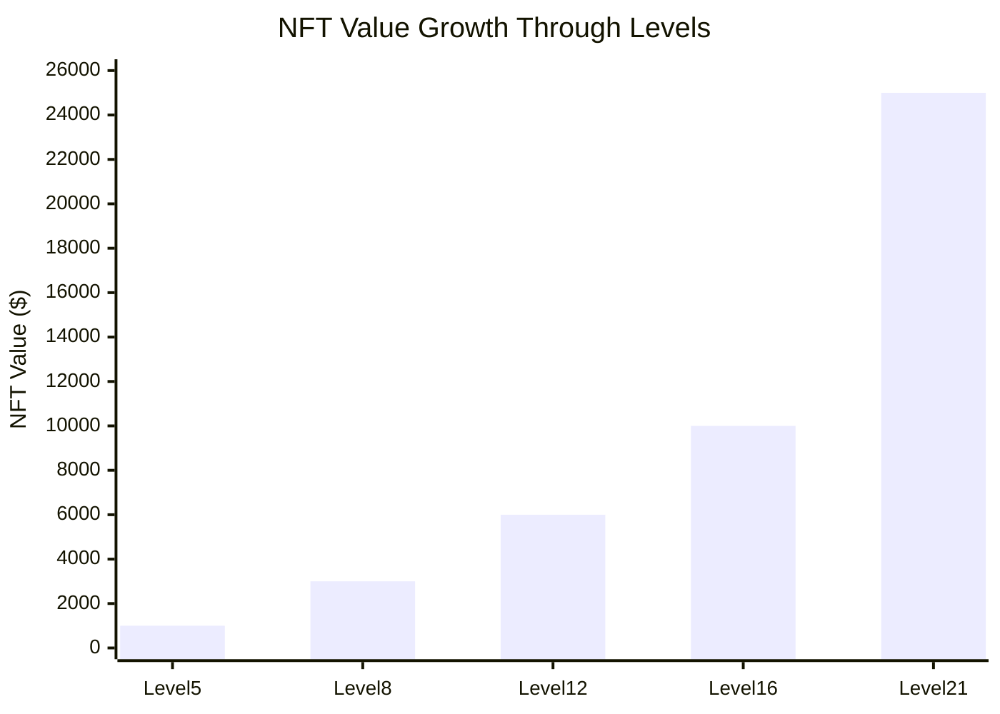

## 🔄 NFT Maintenance Rules

### Active Status Requirements
- Maintain minimum network activity
- Follow platform guidelines
- Regular participation in ecosystem

### Example Maintenance:
- **Monthly:** Verify account activity
- **Quarterly:** Network growth check
- **Annual:** Account review

## 💳 Loan System

### Eligibility & Tiers

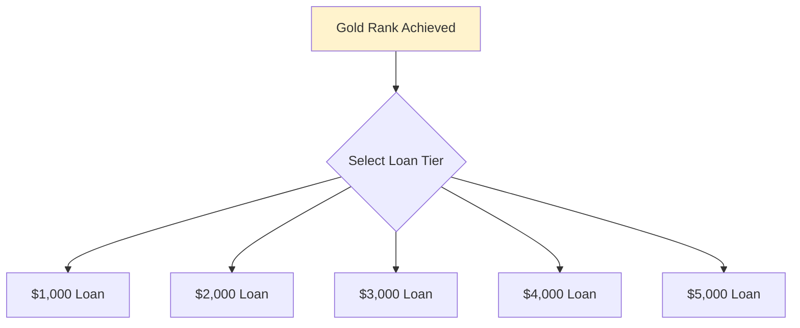

## 📉 Loan Recovery Rules

### Deduction Schedule

| Loan Amount | Monthly Deduction % |
|-------------|---------------------|
| $1,000 | 10% |
| $2,000 | 20% |
| $3,000 | 30% |
| $4,000 | 40% |
| $5,000 | 50% |

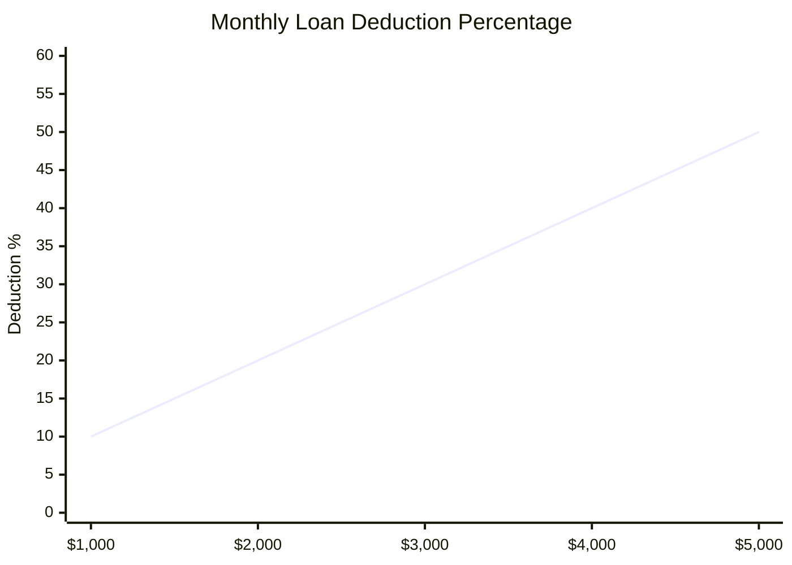

### Unlock Progression

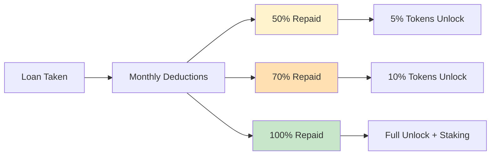

### Complete Loan Flow
1. **Apply for Loan** (Gold Rank required)
2. **Monthly Deductions** from earnings
3. **Progressive Unlocks** at 50% and 70% repayment
4. **Full Restoration** at 100% repayment
5. **Restaking Benefits** activated

## 🔄 Restaking Program

### Post-Loan Benefits

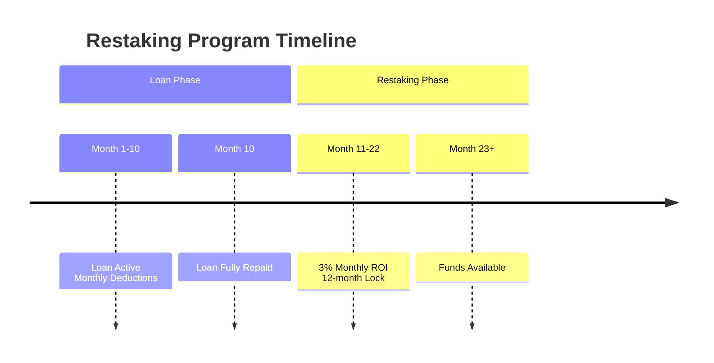

### Restaking Example
- $1,000 fully repaid → 3% monthly ROI = $30 monthly
- 12-month lock ensures consistent returns

## 💎 Tokenomics

### Supply Distribution

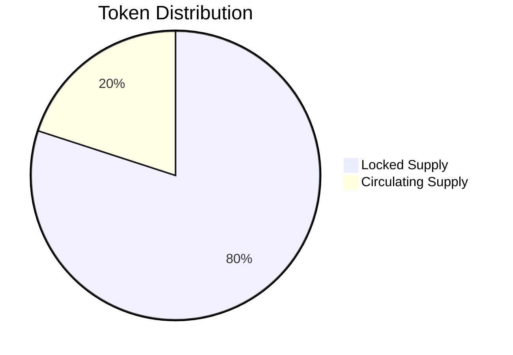

### Burning Mechanism (9%)
- **Transaction Tax:** 9% on all transfers
- **Burn Address:** Permanent token removal
- **Deflationary Effect:** Continuous supply reduction

## 📈 Token Price Mechanism

### Price Drivers
- **Scarcity:** Fixed supply with burning
- **Utility:** Multiple use cases in ecosystem
- **Demand:** Growing user base and adoption
- **Staking:** Reduced circulating supply

### Price Calculation Example
- **Initial Supply:** 1,200,000 tokens
- **Monthly Burn:** ~2% of transactions
- **Projected Growth:** Compound appreciation

## 🌱 Sustainability Model

### System Stability Factors

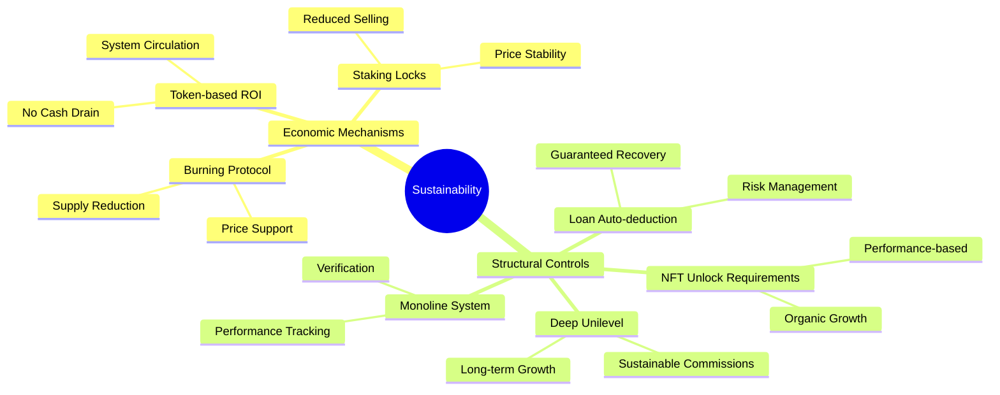

## 🏦 Internal Exchange & Support

### Platform Architecture
- **Internal Exchange:** Token trading platform
- **Wallet Integration:** Secure token storage
- **Support System:** 24/7 customer service
- **Mobile App:** On-the-go access

## 🎯 Getting Started Process

### Complete User Journey

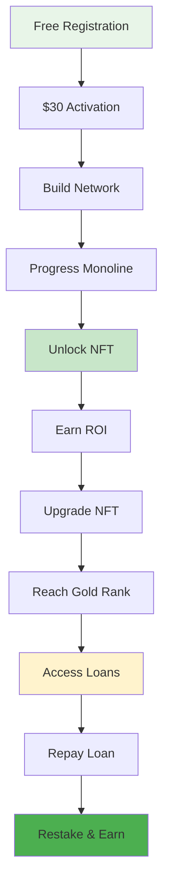

